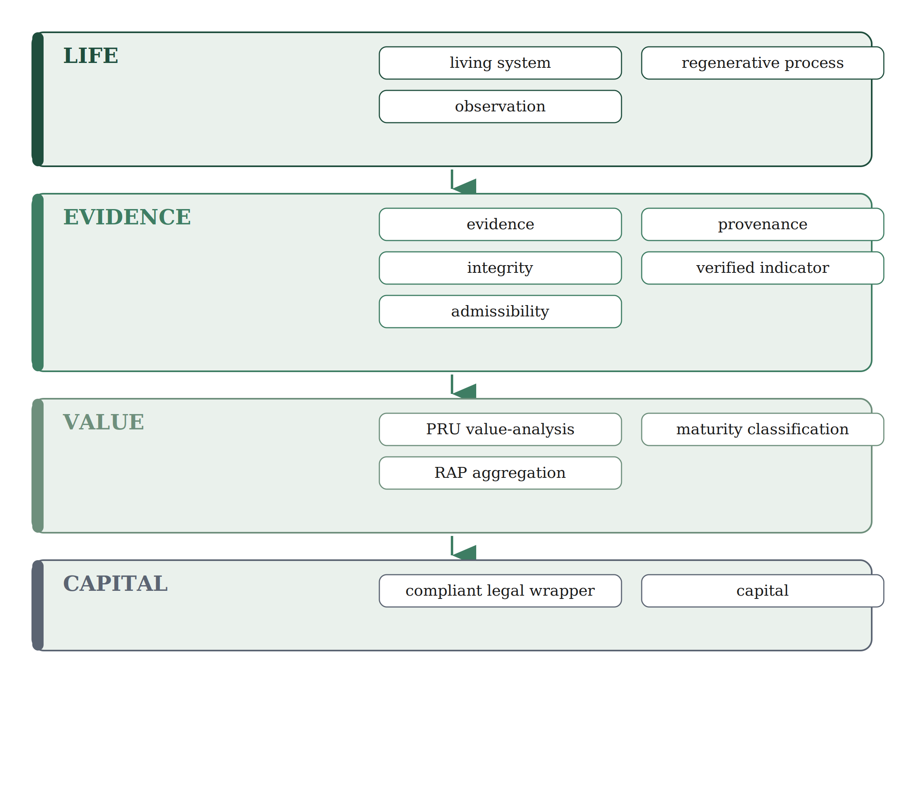
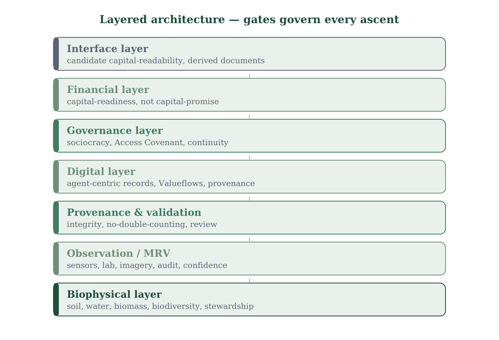
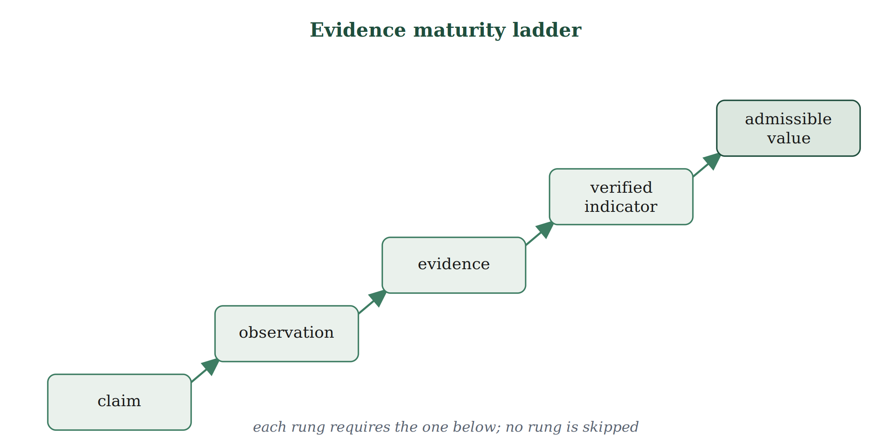
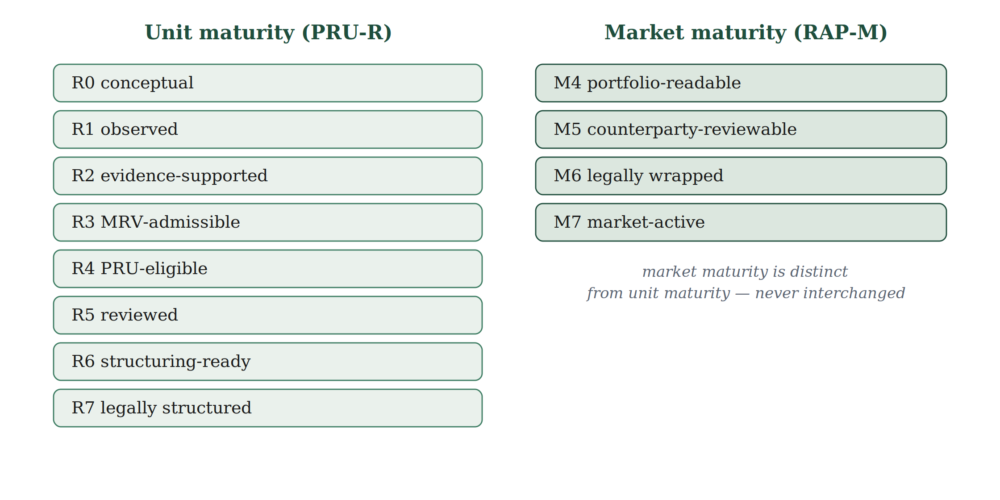
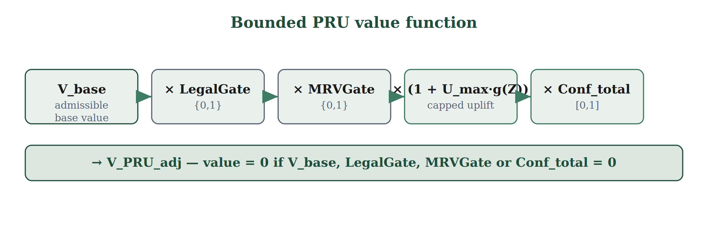

***Work for Nature,***

***and Nature will work for you***

**h•eart•h PROMETHEUS**

Canonical White Paper

*Verified Regeneration as a Candidate Real-World Regenerative Asset-Class Architecture*

Pre-pilot canonical release candidate · Architecture specified · Genesis field validation pending · Non-offering

**Controlling invariant:** *the lowest unresolved gate controls the permitted claim.*

# Release identity and controlling boundary

| Axis | Identifier |
|---|---|
| Canon release (candidate) | `v1.2.0-rc.2` |
| White Paper editorial revision | 8.1 (built on editorial revision 8.0 RC of 27 September 2026) |
| Signed authority in force | `v1.1.2-genesis` — remains controlling until this candidate is ratified and signed |
| Absorbed candidate lines | `v1.2.0-convergence-rc.1` (July 2026); White Paper 7.1 Relational Living-System draft (26 September 2026) |
| Change record | `CANON_CHANGE_RECORD_v1.2.0-rc.2.md` (same folder) |
| Source control | Markdown is the editable source; DOCX/PDF are generated (CCD-001) |

This document is a candidate. It does not amend the signed canon by publication, file creation, repository placement or AI review. Adoption requires the release procedure in X.15. It carries forward the decisions the steward signed on 6 July 2026: CCD-001 (Markdown source control), ARD-001 (A-001 integrated; A-002 declined as written) and the **interim** fail-safe interpretation of TOD-001 (TRBK boundary). TOD-001 is not fully ratified.

| Dimension | Current status | Maximum permitted statement |
|---|---|---|
| Documentary architecture | Candidate; clause reconciliation recorded | The candidate architecture is specified and traceable. |
| Cryptographic release integrity | Not run for this candidate | No signed canonical release exists beyond `v1.1.2-genesis`. |
| Scientific site validity | Not demonstrated | H1–H5 are hypotheses and pilot-required. |
| MRV admissibility | Specified, not operationally admitted | MRV controls are candidate specifications. |
| Runtime | Bounded synthetic proof; Evidence Spine in unmerged engineering candidates | Selected software behaviour has been demonstrated within a stated synthetic scope. |
| Legal | Not admitted | Legal boundaries and issues are identified; counsel opinions are required. |
| Market/financial | Not admitted | Capital-readiness architecture may be discussed; no investability claim is permitted. |
| Governance | Not ratified | Governance design is candidate architecture. |
| Independent assurance | Not demonstrated | Internal and AI-assisted review only. |

# Contents

A. Institutional Boundary and Non-Offering Disclaimer

B. Executive Technical Summary

C. Abstract

D. Executive Summary

E. Core Thesis

F. Problem: Ecological Degradation as Institutional Risk

G. Solution Architecture

H. One Human Ecosystem

I. Verification-first MRV Architecture

J. Evidence Maturity Ladder

K. Prometheus Regenerative Unit (PRU)

L. Regenerative Asset Pool (RAP)

M. Governance Architecture

N. Technology Architecture

O. Artificial Intelligence and Offline Runtime

P. Legal and Regulatory Boundary

Q. Methodology

R. Scientific Validation

S. MRV Controls

T. Financial Architecture and Token Design

U. Risk Architecture

V. Implementation Roadmap

W. Claims Register

X. Appendix System (X.1–X.17)

# A. Institutional Boundary and Non-Offering Disclaimer

This document defines the institutional architecture of h•eart•h Prometheus: a verification-first regenerative infrastructure framework through which living-system performance may become observable, measurable, reviewable, auditable and — only later, under strict evidentiary, legal, governance and market gates — potentially financeable. It is a canon architecture, not a prospectus.

Prometheus does not, by itself, create assets, securities, tokens, fund interests, land rights, cash-flow rights, governance rights, investor protections, public-offering rights, market liquidity or regulatory approval. It is pre-pilot at the level of empirical performance and pre-instrument at the level of legal and market representation. Any future instrument, fund, note, special-purpose vehicle, tokenised representation, revenue right or land-related right requires jurisdiction-specific legal review, enforceable terms, investor disclosure, tax analysis and independent professional assessment. Nothing herein is investment, legal, tax or financial advice.

Prometheus is politically independent and institutionally plural. It may support mission-compatible civic, public, educational, philanthropic, community, or policy initiatives, but it does not endorse candidates or parties, operate as campaign infrastructure, combine regenerative evidence with voter profiling, or permit political sponsorship to alter evidence, methodology, governance, legal boundaries, public-resource custody, or canonical meaning.

Relational or contextual significance, community participation and place-based methodologies create no legal, ecological or financial rights.

# B. Executive Technical Summary

Prometheus is valid only if five principles remain intact. First, evidence precedes value. Second, the Prometheus Regenerative Unit is an analytical interface, not a right. Third, valuation is bounded by an admissible base, binary admissibility gates, a capped regenerative uplift and a confidence factor. Fourth, empirical claims remain falsifiable and are tested against pre-registered hypotheses and explicit comparators. Fifth, no single component is authoritative — not artificial intelligence, sensors, dashboards, distributed records, tokens, legal wrappers or investor narratives. Authority is distributed across evidence, method, review, governance and law. These principles apply to place-contextualised living systems in which human participation is endogenous; role separation remains analytical and governance-based, and no evidence gate is loosened by this recognition.

**Document-stack rule.** This canon is the source-layer document. Shorter derived documents — an investor digest, a technical architecture, a scientific framework, a legal and financial framework, an operational handbook — may be produced for specific audiences, but they preserve these definitions without altering them.

# C. Abstract

The economy depends on place-contextualised living systems — soil, water, biodiversity, climate regulation and biological productivity — in which ecological processes, human participation, institutions and material flows are intertwined. Conventional accounting treats these as externalities until degradation reappears as risk and cost. Prometheus proposes a different architecture: it treats verified regeneration as a candidate form of real-world regenerative infrastructure when ecological performance can be measured, verified, confidence-scored, governed, legally bounded and connected to disciplined capital formation. The One Human Ecosystem is the minimum deployable unit; measurement, reporting and verification make regeneration observable; the Prometheus Regenerative Unit makes verified performance comparable; the Regenerative Asset Pool makes verified units portfolio-readable; and legal wrappers — not tokens or dashboards — create enforceable rights.

# D. Executive Summary

Prometheus converts fragmented regenerative effort into a disciplined institutional pathway. The problem is not that regeneration lacks moral force; it is that regenerative performance is often not measured, comparable, legally bounded, underwritable or capital-readable. Prometheus addresses this through a layered architecture that moves from the living system to capital allocation and is governed throughout by gates. The framework is pilot-first: architecture is not evidence; scientific plausibility is not site validation; external literature is not Prometheus performance data; and no capital-facing claim may outrun the lowest unresolved gate.

# E. Core Thesis

Value should become more durable when the living systems that generate value become healthier, more resilient and more verifiably regenerative over time. This is a conditional thesis, not an automatic appreciation claim. Value relevance increases only when living-system improvement is measured, confidence-scored, legally admissible, governance-reviewed and connected to a recognised financial, contractual, procurement, insurance, crediting or avoided-cost pathway.

# F. Problem: Ecological Degradation as Institutional Risk

Soil depletion, water-cycle instability, biodiversity loss, input dependency, supply-chain fragility, insurance stress and territorial vulnerability are not peripheral sustainability concerns; they are balance-sheet, underwriting, operating and resilience risks. Capital is frequently deployed downstream to manage damage after it materialises, while upstream regenerative capacity remains undercapitalised. Prometheus reframes regeneration as preventive infrastructure: not a branding layer, but a candidate risk-reduction and productive-capacity formation pathway.

# G. Solution Architecture

Prometheus is a transformation architecture. It does not claim to create life, ecological truth or value by declaration; it creates the operational, evidentiary, governance and capital-allocation conditions through which regeneration can become executable, reviewable and institutionally legible. The canonical, non-bypassable sequence is:

*living system → regenerative process → observation → evidence → provenance → integrity → verified indicator → admissibility → PRU value-analysis → maturity classification → RAP aggregation → compliant legal wrapper → capital.*

No stage may be skipped, reordered or collapsed. A later stage never legitimises a missing earlier one.

**Relational living-system frame.** The sequence is a linear gate discipline for evidence and institutions, not a description of how living systems exist. Its first term, *living system*, means a place-contextualised, evolving configuration of human participants, non-human biotic and abiotic components, ecological and social processes and material flows (see Glossary). The frame is recursive and relational; the workflow is linear and non-bypassable. Operational system boundaries are versioned and porous, never ontological closure.

**Place and relational context precondition.** Before baseline interpretation or any transferability claim, Prometheus records a versioned place and relational context: operational system boundary, relevant geology, hydrology, climate and ecology, land-use and disturbance history, stewardship roles and external dependencies. Context constrains interpretation; it never substitutes for baseline, comparator, provenance, independent review or law, and it creates no PRU uplift by itself.

*Figure 1. The non-bypassable value sequence — from life to capital, governed by gates.*

*Figure 2. The layered architecture; gates govern every ascent.*

*Prometheus may also be deployed as civic and territorial infrastructure across communities, schools, public lands, commons, municipalities and bioregional networks. Such deployments remain governed by the same non-bypassable sequence and require local legitimacy, legal-use authority, baseline evidence, assigned stewardship, maintenance continuity, public-claim discipline and independently reviewable records. Civic deployment status does not substitute for PRU maturity, RAP maturity, legal admissibility, scientific validation or capital-readiness.*

*Prometheus distinguishes public value from financial value. Ecological, educational, nutritional, social, health-supportive, resilience, institutional and fiscal benefits shall be classified through a separate civic claims and public-value methodology. Programme activity does not prove outcome; outcome does not prove attribution; public benefit does not create PRU value, RAP maturity, investor rights or monetisable value. The default weight of public-value indicators in PRU valuation is zero unless a separately evidenced, legally recognised and governance-approved pathway is admitted.*

# H. One Human Ecosystem

The One Human Ecosystem is the minimum deployable and auditable unit of regenerative infrastructure: a bounded, place-contextualised social-ecological living-system unit in which human participation is endogenous, integrating soil regeneration, water retention, biomass cycling, biodiversity, food and nutritional capacity, ecological succession, stewardship and the evidence record that documents them. Each OHE carries a versioned operational boundary and explicit external dependencies; it is not an isolated parcel. A One Human Ecosystem is not automatically a financial asset; it becomes value-relevant only when its performance is measurable, traceable, verified, confidence-scored and admissible.

A One Human Ecosystem deployed on public, educational, charitable, institutional, communal or publicly accessible land is governed by the Public-Land OHE Protocol. Planting, funding, maintaining, measuring or participating in such a deployment creates no land, harvesting, governance, data, ecological-credit, PRU, RAP, revenue or financial rights unless established through an independently valid legal instrument. Public-Land OHE status requires authorised use, baseline evidence, assigned stewardship, maintenance continuity, safety, public-resource protection, produce-use rules, MRV, incident governance and a defined termination or transition pathway.

Any One Human Ecosystem or regenerative programme involving children, students, schools or educational institutions is governed by the School Food Forest and Child Safeguarding Protocol. Child welfare, safeguarding, privacy, accessibility, food safety, age-appropriate participation, institutional authority and maintenance continuity precede programme, evidence, communications or capital objectives. Child-related biometric, behavioural, psychological, health, educational or participation data have zero weight in PRU, RAP, governance authority, investor reporting, token allocation or political profiling.

# I. Verification-first MRV Architecture

Verification is infrastructure, not paperwork. Prometheus integrates field sensors, laboratory results, soil and water tests, geo-referenced photographs, satellite, drone and mobile imagery, biodiversity records, operational logs and human or third-party audits. No single source is absolute. Institutional credibility comes from convergence, provenance, method hash, data hash, timestamp, location, reviewer trail, confidence score, anomaly disclosure and disciplined treatment of missing data.

**Embedded observation rule.** Every admitted observation identifies the observer, agent or instrument; the method; time and location; the intervention or management state; calibration or competency state where applicable; and any material conflict or positionality. Observers are part of the system they observe; that is recorded, not hidden.

**Relational evidence firewall.** Unseen, tacit or inferred relational dynamics may be recorded as context or hypothesis. They become evidence only with a declared method, provenance, uncertainty and review. A stored relationship assertion is not ecological truth.

# J. Evidence Maturity Ladder

Every regenerative statement begins as a claim. It becomes an observation when recorded with time, location, source, method and unit; evidence when provenance and integrity are established; a verified indicator when quality, consistency, confidence and review rules are satisfied; and admissible value only when methodology, threshold, legal, no-double-counting and governance gates allow it. The ladder is strictly ordered and never collapsed.

*Figure 3. The evidence maturity ladder — each rung requires the one below.*

# K. Prometheus Regenerative Unit (PRU)

A Prometheus Regenerative Unit is the standardised analytical representation of verified regenerative performance associated with a One-Human-Ecosystem-compatible unit. It integrates living-system performance, the evidence record, methodology, confidence scoring, admissibility, governance review, legal-boundary discipline, no-double-counting controls and maturity classification. It is not land, yield, biomass, a token, a security, investor exposure, governance rights, revenue rights or collateral by default.

**Maturity ladder.** PRU-R0 conceptual → R1 observed → R2 evidence-supported → R3 MRV-admissible → R4 PRU-eligible → R5 reviewed → R6 structuring-ready → R7 legally structured. The maturity class governs what may be claimed.

# L. Regenerative Asset Pool (RAP)

A Regenerative Asset Pool aggregates verified PRU-relevant units across sites, operators, maturities and ecological contexts for portfolio analysis, diversification, risk review and capital-readiness preparation. It does not prove demand, liquidity, offtake, insurance recognition, market price or investability. RAP-M4 is portfolio-readable; M5 counterparty-reviewable; M6 legally wrapped; M7 market-active only within the relevant instrument, counterparty, jurisdiction, disclosure and governance boundary. A pool is not market-ready, liquid or offtake-backed merely because it aggregates PRU logic.

*Figure 4. Unit maturity (PRU-R) and market maturity (RAP-M) are distinct ladders, never interchanged.*

# M. Governance Architecture

Prometheus governance uses differentiated sociocracy: local operational autonomy at the first tier, cluster tactical coordination at the second, and constitutional or bioregional decisions at the third. Tokens, founder status, infrastructure custody, operator role, capital commitments, technical administration or AI access may coordinate routine operations but may not determine constitutional meaning, PRU or RAP admissibility, legal boundaries, human-dignity safeguards or protected-pathway interpretation. The Access Covenant binds entry: access is not a licence to extract, participation is not a right to bypass, and capital is not sovereignty over life.

**Role separation and conflict of interest.** Human embeddedness in the living system never erases conflict-of-interest controls. A person or organisation that co-designed or implemented a method, site intervention or software scope cannot serve as independent reviewer of that same contributed scope.

**Continuity and custody.** The constitutional core is designed to resist time and capture, including by hostile artificial superintelligence: a custody hierarchy — humans, then institutions, then AI — governs continuity if human governance fails, with AI permanently subordinate and non-authoritative.

Prometheus-compatible Town Squares and Community Hubs are bounded civic operating environments, not automatic representatives of a community. Gathering, attendance, exchange, volunteering, market activity or public visibility do not create governance legitimacy, social impact, ecological proof, PRU value or financial rights. Such hubs require authorised use, transparent access, role-defined stewardship, treasury and data controls, political neutrality, commercial transparency, safety, conflict resolution, maintenance continuity, Claims Register discipline and a defined closure or succession pathway.

# N. Technology Architecture

Prometheus is agent-centric and provenance-first because regeneration is contextual, distributed and relational. Source chains preserve agent-specific records; validation rules evaluate entries; a distributed hash space supports shared availability; and a Valueflows-aligned model structures resources, events, agents and transformations. The digital stack is an operational memory and provenance substrate — not ecological truth, legal status, market demand or investor protection.

**Runtime stance.** The runtime evaluates and records; it never certifies value. Its canonical self-description — “evaluation, not certification” — is a permanent design constraint. No software component becomes institutionally admissible merely because it exists, compiles or runs locally.

**Versioned evidence records.** The data model records claims and observations *about* a living system, never the full ontology of the system. Its versioned record types are: place context, system boundary, method, observer or instrument, observation, evidence package, relationship assertion, review attestation and admissibility decision. Relationship assertions are attributable, time-bounded, scoped, provenance-bearing and uncertain by design. Context, boundary and method records are append-and-supersede; history is never overwritten. No runtime record carries PRU monetary value. Claims are keyed by an immutable semantic `claim_uid`; release-local labels such as C-001 are display aliases only (see W).

# O. Artificial Intelligence and Offline Runtime

Artificial intelligence is proportional, evidence-bound and assistive. It may parse field notes, normalise events, classify evidence, detect anomalies, draft reports, support local retrieval, check schema consistency and prepare review material. It may not validate verification, create PRU value, approve RAP inclusion, create token rights, generate legal opinions, certify dashboards, authorise governance or transform research-only material into admissible value. AI may surface or classify relational patterns but cannot promote an inferred relationship into a verified fact; AI-assisted transformations carry model and version provenance and change evidence status only through a declared human or method gate. Offline-first continuity is mandatory: Prometheus thinks locally, remembers locally, recovers locally and synchronises globally only when network paths exist.

# P. Legal and Regulatory Boundary

Only valid legal instruments create enforceable rights. PRU analysis creates no rights; RAP maturity creates no liquidity; TRBK, as an external asset or interface, creates no Prometheus right or entitlement (T; X.1); place-based or relational-development participation creates no property, governance, financial or ecological-credit entitlement by default; an operational transaction layer creates no PRU value; dashboard display creates no legal status; governance participation creates no economic entitlement; and runtime execution creates no investor protection. Legal review must precede any capital-, investor-, token-, instrument-, revenue-, land- or market-facing use. A securities analysis and an EU crypto-asset analysis are provided in the Appendix System.

Prometheus-compatible commons, Community Land Trusts, cooperatives, public concessions, stewardship covenants, asset locks and related custody structures create no protected status merely by name. Each requires a jurisdiction-specific Rights and Responsibilities Map identifying title, use, possession, stewardship, governance, benefit, data, capital, creditor, succession, default, insolvency, termination and reversion rights. No structure may be described as community-owned, asset-locked, permanent, irrevocable, bankruptcy-proof or legally protected beyond the scope supported by valid instruments, factual control and competent legal review.

Prometheus civic, ecological, beneficiary, educational, stewardship, governance and MRV data shall not be converted into voter, donor, political-preference, persuasion, turnout or campaign-targeting data. Any interaction with parties, candidates, campaigns, referenda, elected officials or electoral organisations requires substantive separation of entities, personnel, finance, systems, databases, communications and public resources. Access to food, plants, land, education, public services or community benefits shall never be conditioned on political support, voting behaviour, campaign activity, donation or political-data consent.

Any Prometheus-compatible propagation or distribution of seeds, slips, cuttings, tubers, plants, trees, nursery stock, food-producing material, tools or related regenerative benefits is governed by the Regenerative Propagation and Civic Distribution Protocol. Such benefits remain unconditional with respect to voting, political support, campaign activity, donation, publicity, testimonial, token ownership and unrelated data consent. Distribution counts are outputs only and do not establish establishment, production, consumption, food security, public value, ecological performance, political legitimacy, PRU eligibility or financial value. Species-specific initiatives, including a Sweet Potato Civic Propagation Pilot, remain subordinate to this general protocol.

# Q. Methodology

**Controlling value expression.** V_PRU_adj = V_base × LegalGate × MRVGate × (1 + U_max × g(Z)) × Conf_total.

Here V_base is the admissible base value from productive or contractually grounded components (domain ≥ 0); LegalGate and MRVGate are binary admissibility gates in {0,1}; U_max is a capped, versioned, governance-approved maximum regenerative uplift; g(Z) is a normalised regenerative score bounded in \[0,1\]; and Conf_total is conservative confidence aggregation in \[0,1\]. The regenerative score is Z = β_S·SRI + β_R·RPI + β_C·CESI + β_M·MIS − β_P·Penalty, with all sub-indices in \[0,1\]. Zero-value conditions: if V_base, LegalGate, MRVGate or Conf_total equals zero, financially admissible PRU value is zero. This is the single controlling expression; any other formula is diagnostic or illustrative and subordinate to it. Place, relational, public-value, resilience-attribute (for example Agency, Buffers, Connectivity, Diversity) and human-state variables carry a default weight of zero in Z and in Conf_total unless separately method-linked, verified, legally admitted and governance-approved; the ontology amendment changes nothing in this expression.

*Figure 5. The bounded PRU value function and its zero-value conditions.*

**Pre-pilot rule.** Before sufficient pilot evidence exists, the capital-facing uplift effect of U_max is zero: if PilotEvidence = 0, then U_max_capital = 0, and V_PRU_adj may not include regenerative uplift for investor-facing, RAP-facing or other capital-facing use. Literature, simulation, architecture or narrative cannot create site uplift. A PRU dry-run is internal, non-capital analysis only.

**Confidence gate.** For capital purposes, PRU value is held at zero until a governance-versioned Bayesian confidence threshold (target at least 0.85), supported by difference-in-differences estimation against a comparator, is met. A single p-value is one input, never the gate.

# R. Scientific Validation

Prometheus pre-registers five hypotheses: H1 soil function improves; H2 water-cycle function improves; H3 input dependency decreases without unacceptable productivity loss; H4 yield and output stability improve under stress; and H5 a cooperative syntropic surplus exists, in which total system output exceeds the sum of isolated components. H5 is the highest-risk claim and is tested with paired plots, blocked randomisation where feasible, matched comparators or synthetic controls; reports must disclose effect size, confidence interval, sensitivity analysis, management differences and weather or soil confounders.

**External evidence anchor.** A peer-reviewed review of syntropic farming systems (Jacobi et al., The Lancet Planetary Health, 2025; 9: e314–e325; CC BY 4.0; 67 studies) raises the prior plausibility of these hypotheses — reporting total-system Land-Equivalent Ratios of 2.8–4.1 and carbon gains in most measuring studies — but it does not validate any Prometheus site. The evidence base is overwhelmingly tropical, with only three temperate-zone studies, all under seven years; single-crop yields can be materially lower than monoculture; and profitability sometimes arrives only after roughly a decade. The Genesis programme exists to close this temperate-zone evidence gap.

**Genesis programme tiers.** Prometheus distinguishes the Genesis Minimum Evidence Pilot (G-MEP) from the Genesis Validation Program (G-VP). G-MEP is a bounded first-stage field programme of approximately twelve months, intended to establish place context, baseline, methods, MRV, provenance, operational feasibility and early-response evidence. G-VP is the longer empirical programme, up to forty-eight months, required to test multi-cycle hypotheses, including input dependency (H3, at least 24 months of input and yield records), stress stability (H4) and cooperative syntropic surplus (H5, the stricter of the preregistered minimum biological cycles and the calendar horizon). Completion of either tier does not itself establish validation; months are decision points, not evidence states. No first-year result may be represented as durable multi-year regenerative performance. If no qualifying natural disturbance occurs, H4 remains unresolved rather than failed; no harmful disturbance is manufactured to force it.

| Timepoint | Maximum permitted claim (if, and only if, the applicable gates close) |
|---|---|
| Pre-field | Architecture specified; protocol candidate |
| Baseline complete | Site, context and baseline description; no improvement or superiority |
| 12-month G-MEP review | Pilot-observed early H1/H2 signals within exact method, plot and time scope; H3–H5 unresolved |
| 24 months | H3 conditional, if input/output and comparator gates close |
| 36 months | H4, where qualifying disturbances and multi-cycle evidence exist |
| 48 months | H5, only with preregistered paired or matched design, effect size, interval, sensitivity analysis and independent review |

**Experimental system boundary.** The Sicily G-MEP uses the surveyed site boundary as its versioned experimental system boundary, distinct from the cadastral parcel area. Irrigation sectors are management strata, not independent replicates; areas left uncultivated but under permanent cover or project hydrology are not automatically untreated controls. Spatial-design freeze requires the authoritative vector project drawing, reconciled sector and swale geometry, treatment and spillover polygons and a comparator that passes a preregistered feasibility test.

# S. MRV Controls

MRV controls include provenance, method hash, data hash, reviewer trail, calibration state, inter-rater reliability, anomaly disclosure, missing-data penalties, adversarial review, no-double-counting invariants, unique event-identity tuples and duplicate-claim detection. A proof-of-physical-origin mechanism is adversarial assurance, not unforgeability: it combines signed provenance, device and observer identity, time and location controls, calibration, chain of custody, cross-source convergence, sampling and review to raise the cost of fabrication and improve its detectability. A correctly signed record can still carry fabricated content; cryptographic integrity is never represented as physical or ecological truth. A distributed-ledger record does not by itself prove ecological uniqueness; a bridge event does not prove admissibility; a token wrapper does not create valid representation; an oracle does not create ecological truth.

# T. Financial Architecture and Token Design

The financial architecture is capital-readiness, not capital-promise. It makes regenerative performance comparable, confidence-adjusted, bounded, risk-reviewable and legally structurable. Base value derives from admissible productive or contractually grounded components; ecological-performance value enters only when measured, verified and linked to recognised pathways; and systemic co-benefits remain research context unless separately evidenced, contracted and legally admitted.

**Token and instrument boundary (interim — TOD-001, pending full ratification and counsel).** Within Prometheus, TRBK is an external asset or interface governed outside this canon. Prometheus does not issue, reissue, sponsor, guarantee, redeem, custody, exchange, price-support or confer rights through TRBK. Any investment exposure, if ever offered, would require a separate, disclosed, jurisdiction-specifically admitted legal instrument and is not part of this canon. The PRU remains a non-token analytical index. These three objects are never collapsed (X.1). Labels such as utility, access, governance, payment or decentralised do not determine legal classification, which is fact- and jurisdiction-dependent and requires counsel.

**Adaptive risk control.** A tail-risk model maps correlated drought, operator failure and market stress; a systemic-coherence index and an automatic regenerative brake throttle issuance when coherence degrades. This is a governance circuit-breaker, never a marketing claim.

# U. Risk Architecture

Primary risks include ecological variance; execution and operator capacity; weak verification; single-crop yield drag; long payback horizons; labour intensity; temperate-validity uncertainty; legal classification; token confusion; model risk; runtime failure; no-double-counting failure; absent market demand; liquidity illusion; governance capture; community conflict; reputational exposure; tail dependence; semantic drift across documents and repositories; claim-identity collision; system-boundary version drift; relational overreach; reviewer conflict of interest; model-completeness illusion; and public-copy staleness. Each risk carries an owner, a trigger, a mitigation, a residual-risk note, a review cadence and a link to the Claims Register.

# V. Implementation Roadmap

Prometheus scales by gates, not by narrative. The phased path and its gates are:

| **Phase** | **Outputs** | **Gate** |
|----|----|----|
| **0** | Canon, claims register, semantic firewall and method hierarchy | No contradictory definitions; acceptance checklist passed |
| **1** | Genesis G-MEP design: place and relational context record; versioned experimental system boundary; Experimental Design v0.1; baseline plan; comparator topology; SUNRISE-compatible field layer; MRV plan; governance roles | G-SIC-01/02/08 and independent review close; preregistration approved before confirmatory collection/intervention |
| **2** | Baseline evidence package: soil field methods + laboratory chemistry, water, biodiversity, productivity, operations, provenance and chain of custody | No improvement claim before baseline; real-data integrity gate active |
| **3** | Operational MRV cycle; evidence lineage with method and data hashes | Lineage and hashes complete |
| **4** | PRU dry-run: normalised indicators, confidence, admissibility gates, sensitivity | Dry-run labelled non-capital-facing |
| **5** | Independent scientific, MRV, legal, runtime and governance review | Claims Register updated; runtime-verification package versioned |
| **6** | Demand exploration; counterparty category; price-discovery memo | RAP maturity assigned without inflation |
| **7** | Legal wrapper analysis; rights map; disclosures; tax; custody where needed | No capital-facing claim before admission |
| **8** | Limited diligence package; investor digest; data-room index | Engaged observation and pilot participation posture |

**Operational runtime.** In parallel, the runtime is built, packaged and verified on an agent-centric conductor with an authorised application interface and a smoke-test endpoint whose canonical response is “evaluation, not certification.” No runtime component is production-admitted until the independent-review gate closes.

Civic and territorial expansion shall begin through a bounded Civic and Territorial Genesis Pilot rather than through immediate programme replication. The Pilot shall pre-register its modules, hypotheses, units of analysis, baseline, comparators, methods, indicators, missing-data rules, stopping conditions and Claims Register entries before confirmatory outcome analysis. Pilot completion does not establish validation, public value, PRU eligibility, RAP maturity, capital readiness or replication readiness. Replication is admitted only for the specific components and contextual envelope supported by evidence, operational continuity, legal authority, safeguarding, maintenance, independent review and governance decision.

# W. Claims Register

The Claims Register is the control surface between vision and admissibility. No claim travels into investor-, market-, token-, procurement- or insurance-facing material without its register status.

**Claim identity.** Each claim has an immutable semantic `claim_uid`, which is the only key that runtime, bridge, console, website, deck or campaign may use across systems. The C-numbers below are release-local display labels for `v1.2.0-rc.2` only; the same C-number in another lineage (for example runtime v7.x) may mean something different and is never resolved without its lineage. Migration is additive: no signed release is rewritten.

| **Label** | **claim_uid** | **Claim** | **Evidence status** | **Investor-facing?** | **Disciplined wording** |
|----|----|----|----|----|----|
| **C-001** | `prometheus.architecture.candidate_regenerative_infrastructure` | Verified regeneration can become a candidate real-world regenerative asset-class architecture. | Architecture specified; validation pending | Limited | A candidate architecture subject to evidence, legal and market gates. |
| **C-002** | `prometheus.ohe.minimum_deployable_auditable_unit` | The One Human Ecosystem is the minimum deployable and auditable unit. | Architectural definition | Yes (as definition) | A bounded, place-contextualised social-ecological unit from which evidence may be generated. |
| **C-003** | `prometheus.pru.analytical_interface_no_rights` | The PRU renders verified performance as capital-readable analysis. | Specified | Yes (with boundary) | The PRU is an analytical interface only; it creates no rights. |
| **C-004** | `prometheus.rap.portfolio_readability_not_market_admission` | The RAP aggregates PRUs into portfolio structures. | Specified | Limited | A RAP is portfolio-readable before it is market-readable. |
| **C-005** | `prometheus.hypothesis.h5_cooperative_syntropic_surplus` | Syntropic systems may generate a cooperative surplus (H5). | Hypothesis | No | A testable hypothesis, not a presumption. |
| **C-006** | `prometheus.hypothesis.r1_risk_compression` | Regenerative systems may reduce risk over time. | Hypothesis | Limited | Risk compression is conditional, measured and hazard-adjusted. |
| **C-007** | `prometheus.hypothesis.t1_time_positive_value` | Time-positive value may emerge under verified regeneration. | Hypothesis | Limited | Conditional on verified maturation and admissibility. |
| **C-008** | `prometheus.trbk.external_interface_no_prometheus_rights` | TRBK is an external asset or interface governed outside this canon. | Interim boundary (TOD-001); counsel pending | No | Prometheus confers no rights through TRBK; pathways P0 default, P1 design only, P2 NO-GO, P3 RED, P4 prohibited. |
| **C-009** | `prometheus.investment_exposure.separate_legal_instrument` | Any investment exposure requires a separate legal instrument. | Pre-instrument; counsel-gated | No (no offer) | A separate, disclosed, jurisdiction-specifically admitted instrument outside this canon. |
| **C-010** | `prometheus.ai.assistive_non_authoritative` | AI assists verification workflows. | Architecture specified | Yes | AI assists review; evidence and method govern admissibility. |
| **C-011** | `prometheus.digital_provenance.traceability_not_truth` | Distributed records support provenance. | Architecture specified | Limited | Records support traceability, not ecological truth. |
| **C-012** | `prometheus.frontier_research.zero_weight_until_admitted` | Frontier research may inform future inquiry. | Research-only | No (except disclosure) | Research-only and zero-weight for PRU and RAP. |
| **C-013** | `prometheus.ontology.human_participation_endogenous` | Human participation is endogenous to the living system. | Candidate methodological amendment | Limited | Role separation remains analytical and governance-based. |
| **C-014** | `prometheus.context.conditions_interpretation_transferability` | Place and relational context condition interpretation and transferability. | Candidate methodological amendment | Limited | Context does not prove regeneration or create value. |
| **C-015** | `prometheus.science.external_literature_prior_plausibility` | External literature may raise prior plausibility. | External evidence | Limited | Literature does not validate a Prometheus site. |
| **C-016** | `prometheus.site.validation_not_established` | No Sicily site-performance validation is established. | Pilot-required | Yes (as boundary) | Validation awaits baseline, comparator, preregistration, analysis and independent review. |
| **C-017** | `prometheus.runtime.evaluation_not_certification` | The runtime evaluates and records. | Architecture specified | Yes | Evaluation, not certification. |
| **C-018** | `prometheus.review.independence_scope_separation` | Contributors are not independent reviewers of their own scope. | Methodological | Yes | Independence is scope-specific and conflict-declared. |

The candidate `claim_uid` `prometheus.token.access_utility_candidate` (claim UID registry v0.2, 29 September 2026) is **deprecated** and must not be used: it encoded the A-002 classification that ARD-001 declined. Its replacement is `prometheus.trbk.external_interface_no_prometheus_rights`.

***X. Appendix System***

***X.1 Token and Instrument Separation (interim — TOD-001)***

| ***Object*** | ***Canonical position*** | ***Boundary / forbidden interpretation*** |
|:---|:---|:---|
| ***TRBK*** | *An external asset or interface governed outside this canon. Prometheus does not issue, reissue, sponsor, guarantee, redeem, custody, exchange, price-support or confer rights through it.* | *Holding or using TRBK creates no PRU/RAP status, ecological-evidence status, constitutional or governance authority, land or resource right, cash-flow, revenue or investor right, public-benefit entitlement, assurance or certification status.* |
| ***Separate legal instrument*** | *Any investment exposure, if ever offered, requires a distinct, disclosed instrument admitted under jurisdiction-specific law.* | *Outside this canon; no offer is made; never disguised as utility; counsel-gated.* |
| ***PRU analytical index*** | *An analytical quality index of verified regenerative performance, comparable to a rating.* | *Never tokenised; never a right; never investor exposure.* |

**TRBK pathway policy (this release).** P0 — no TRBK relationship: default, permitted. P1 — named-counterparty design or testing only, after contract, privacy, authentication, replay, sanctions and legal-perimeter review; no live transfer. P2 — live payment for Prometheus services: NO-GO. P3 — regulated financial or investment function: RED. P4 — custody, exchange, transfer, redemption, wrapping, DEX, market-making or liquidity support: prohibited.

**Status.** This boundary is the interim fail-safe interpretation adopted under TOD-001. It is an Eternity-level (legal semantic firewall) matter: full ratification requires the high-threshold multi-stakeholder process and a counsel opinion, neither yet complete.

***X.2 Securities and Crypto-asset Boundary***

Prometheus provides no securities, Howey, MiCA or other crypto-asset classification of TRBK or of any instrument. The preliminary utility-token analyses carried by earlier candidates (editorial revisions 7.1 and 8.0) are withdrawn from the active canon and retained only as provenance, because they presupposed the A-002 classification declined under ARD-001. Any such analysis is a counsel deliverable, scoped to verified facts and jurisdiction, and enters the canon only through amendment.

***X.3 (reserved)***

Reserved to preserve section numbering of the Appendix System.

***X.4 Red-Team Validation Matrix***

| ***Attack surface*** | ***Failure mode / concern*** | ***Mitigation / control*** |
|:---|:---|:---|
| ***Securities ambiguity*** | *PRU, token or RAP read as investment interests* | *Front-loaded semantic firewall; legal-opinion gate; TRBK external to the canon; instrument separation* |
| ***Greenwashing*** | *Claims outrun verification evidence* | *Claims register; evidence ladder; prohibited wording; capital-language review* |
| ***Scientific overclaiming*** | *Cooperative surplus treated as proven* | *Pre-registration; comparator designs; scientific advisory review* |
| ***Dashboard or AI authority*** | *Outputs treated as certification* | *No-authority invariant; assistive-only rule; human review; audit logs* |
| ***No-double-counting failure*** | *Same event claimed twice* | *Unique event-identity tuples; threat model; integrity committee* |
| ***Market-readiness inflation*** | *Portfolio-readable pool described as investable* | *Maturity ladder; demand file; investment-committee veto* |
| ***Runtime overstatement*** | *Prototype called production-ready* | *Runtime-verification package; release governance gate* |
| ***Capital capture*** | *Capital overrides stewardship* | *Constitutional governance; continuity clauses; veto process* |

***X.5 Capital-Readiness Gate Matrix***

| ***Gate level*** | ***Required evidence*** | ***Permitted consequence*** |
|:---|:---|:---|
| ***Conceptual architecture*** | *Canon definitions, legal boundary, source-layer logic* | *Architecture may be discussed; no performance or investment claim* |
| ***Formal methodology*** | *Bounded value function, confidence, normalisation, value gates* | *Method may be reviewed; not validated performance* |
| ***Pilot evidence*** | *Baseline, comparator, repeated measurement, confidence range* | *Claims may be pilot-observed within scope* |
| ***Third-party review*** | *Independent ecological, MRV, technical and legal review* | *Claims may become reviewed, not universally certified* |
| ***Legal wrapper*** | *Jurisdiction-specific rights, disclosure, tax and compliance* | *Rights may be created only within the wrapper* |
| ***Institutional diligence*** | *Data room, risk register, demand file, operating model* | *Counterparty-reviewable status possible* |
| ***Capital deployment*** | *A closed legal instrument and capital pathway* | *Capital-facing use only within the instrument boundary* |
| ***Portfolio scaling*** | *Multi-site evidence, correlation, tail-risk, operator capacity* | *Portfolio scale only after gate convergence* |

***X.6 Scientific Falsifiability Matrix***

| ***ID*** | ***Hypothesis*** | ***Comparator / method*** | ***Minimum evidence*** | ***Falsification condition*** |
|:---|:---|:---|:---|:---|
| ***H1*** | *Soil function improves* | *Matched plot; organic matter, biology, infiltration* | *≥1 season, repeated* | *No improvement vs comparator after controls* |
| ***H2*** | *Water-cycle function improves* | *Baseline/control; moisture, infiltration* | *Repeated observation* | *No positive association after controls* |
| ***H3*** | *Input dependency decreases* | *Comparator; input and labour accounting* | *24 months* | *No reduction without productivity loss* |
| ***H4*** | *Output stability improves* | *Matched zones; stress-event data* | *2–3 seasons* | *No faster recovery or lower damage* |
| ***H5*** | *Cooperative surplus exists* | *Paired plots / synthetic control; LER, diversity-adjusted yield* | *Pre-registered* | *System output not materially above comparator* |

***X.7 Hypothesis–Evidence Mapping***

| ***ID*** | ***Peer-reviewed literature signal*** | ***Status / controlling gate*** |
|:---|:---|:---|
| ***H1*** | *Soil fertility, organic matter and litter input; land-use-history dependent* | *Pilot-required at site; admissibility gate* |
| ***H2*** | *Favourable microclimate and moisture trends, mixed; no temperate evidence* | *Pilot-required; rainfall-normalised analysis* |
| ***H3*** | *Input dependency declines over time; offset by early labour and input cost* | *Pilot-required with full input and labour accounting* |
| ***H4*** | *Diversity and resilience buffer price, pest and drought shocks* | *Pilot-required across two to three seasons* |
| ***H5*** | *Land-Equivalent Ratio 2.8–4.1; consistent, not confirmatory* | *Non-admissible for PRU, RAP or investor use until the difference-in-differences interval excludes zero* |

***X.8 What Prometheus Is Not***

- *a public offering;*

- *an investment fund or asset manager;*

- *a guaranteed-return product;*

- *a carbon-credit shortcut;*

- *a speculative token system;*

- *an AI-governed ecological truth engine;*

- *a dashboard-based valuation machine;*

- *a substitute for legal, scientific, financial, ecological or tax due diligence;*

- *validated merely because it is architecturally coherent;*

- *market-ready without evidence, a legal wrapper, demand proof and governance admission.*

***X.9 What Must Be True for Prometheus to Work***

- *Field evidence must be reliable, timestamped, geolocated, method-linked and reviewer-traceable.*

- *Ecological indicators must be measurable or transparently treated as research-only.*

- *Methods must be reproducible, versioned and sensitivity-tested.*

- *Governance must be enforceable, transparent, anti-capture and reviewable.*

- *Legal wrappers must be compliant before any rights-bearing or capital-facing use.*

- *Financial claims must remain downstream from evidence and legal admissibility.*

- *Artificial intelligence must remain assistive and non-authoritative.*

- *Pilots must validate, weaken or falsify claims, never serve as ceremony.*

- *Capital must not bypass stewardship, evidence, governance or law.*

- *The lowest unresolved gate must control the permitted claim.*

***X.10 Final Acceptance Checklist***

- *All PRU definitions are single-source; later appearances are references.*

- *Unit maturity and market maturity are never used interchangeably.*

- *Every formula is classified as controlling, diagnostic, conceptual, research-only or illustrative.*

- *The bounded value function is present with gates, cap, score and zero-value conditions.*

- *Frontier material is excluded from PRU, RAP, confidence and capital claims.*

- *AI, dashboards, runtime, repositories and interfaces are explicitly non-authoritative.*

- *No token language implies ownership, yield, transferability, liquidity or redemption without a legal wrapper.*

- *No market-facing pool claim appears without a demand file and a register status.*

- *No pilot performance claim appears without baseline, comparator, confidence range and reviewer trail.*

- *The claims register, red-team, capital-readiness, falsifiability and semantic firewall are present.*

- *Positioning is candidate asset-class architecture, never an investable asset class today.*

- *A checksum, method hash and data-room index precede external distribution.*

- *Every cross-system claim reference uses `claim_uid`; no bare C-number is a key.*

- *No text implies humans are outside the living system, and no relational or contextual narrative is promoted to evidence or value.*

- *No TRBK description departs from X.1 until TOD-001 is fully ratified with counsel.*

- *No downstream artefact (runtime, bridge, console, website, deck, campaign) states a stronger claim than this canon; artefacts depending on a changed claim are marked stale until reviewed.*

***X.11 Independent Review Anticipation***

| ***Review lens*** | ***Toughest questions*** | ***Where pre-answered*** |
|:---|:---|:---|
| ***Systems and formal methods*** | *Is the value model well-posed and reproducible? Architecture versus proof?* | *Section Q (bounded formula, zero-value, confidence gate)* |
| ***Complexity science*** | *Is cooperative surplus asserted as doctrine? What is the external-validity boundary?* | *Section R; X.6–X.7 (estimand, difference-in-differences; tropical-to-temperate not assumed)* |
| ***Fiduciary and allocation*** | *Where are downside risks and the path to investability?* | *Section T; X.5; Claims Register; lowest-gate-controls-claim rule* |
| ***Securities and crypto-asset*** | *Is any token a disguised security?* | *Section T; X.1–X.2 (TRBK external to the canon; pathway policy; classification reserved to counsel)* |

***What is not yet validated. All site-level performance under H1–H5 is pilot-required and unvalidated. The Sicily Genesis workstream has advanced to Experimental Design v0.1 and field-baseline execution templates, but preregistration is not frozen, G-SIC-01 geometry population is suspended, comparator topology and power/MDE remain open, and laboratory soil chemistry is pending. Temperate water-cycling, long-horizon performance and the cooperative-surplus hypothesis remain untested for the target region and non-admissible for PRU uplift, RAP inclusion or investor claims until the Genesis evidence gate clears. Risk-compression and time-positive dynamics require multi-site and multi-year data; all token, security and PRU representations remain downstream of evidence, methodology, governance and jurisdiction-specific legal review.***

***X.12 Glossary***

| ***Term*** | ***Canonical meaning*** | ***Is not*** |
|:---|:---|:---|
| ***Living system*** | *A place-contextualised, evolving configuration of human participants, non-human biotic and abiotic components, ecological and social processes and material flows; the first term of the non-bypassable sequence.* | *Not a closed parcel; not evidence or value by itself.* |
| ***One Human Ecosystem*** | *The minimum deployable and auditable regenerative unit: a bounded, place-contextualised social-ecological living-system unit with human participation endogenous.* | *Not automatically a financial asset; not an isolated parcel.* |
| ***Place and relational context*** | *The versioned record of boundary, setting, history, stewardship and dependencies required before baseline interpretation.* | *Not evidence; carries zero automatic PRU weight.* |
| ***claim_uid*** | *The immutable semantic identity of a claim across all systems.* | *Not a release-local C-number.* |
| ***G-MEP / G-VP*** | *Genesis Minimum Evidence Pilot (~12 months) / Genesis Validation Program (up to 48 months).* | *Neither establishes validation by completion.* |
| ***MRV*** | *The verification-first measurement, reporting and verification substrate.* | *Not certification or truth by itself.* |
| ***PRU*** | *The analytical representation of verified regenerative performance.* | *Not land, yield, token, security or right.* |
| ***RAP*** | *The portfolio aggregation of PRU-relevant units.* | *Not a security; not liquidity.* |
| ***TRBK*** | *An external asset or interface governed outside this canon (interim, TOD-001).* | *Not a Prometheus instrument; confers no Prometheus right, status or entitlement.* |
| ***Operational transaction layer (HoloFuel)*** | *An operational network resource for routine exchange within relevant Holochain contexts.* | *Not evidence, PRU or RAP value, governance authority, investor exposure or a legal wrapper.* |
| ***Unit maturity (R0–R7)*** | *The ladder from conceptual to legally structured.* | *Not market maturity.* |
| ***Market maturity (M4–M7)*** | *The ladder from portfolio-readable to market-active.* | *Not unit maturity.* |
| ***Verified indicator*** | *An indicator passing quality, confidence and review rules.* | *Not a raw observation or a claim.* |
| ***Admissible value*** | *Value passing methodology, legal, no-double-counting and governance gates.* | *Not any computed number.* |
| ***Candidate asset-class architecture*** | *The positioning of Prometheus.* | *Not an investable asset class today.* |
| ***Confidence aggregation*** | *Conservative confidence scoring in the range zero to one.* | *Not a marketing score.* |
| ***Research-only material*** | *Frontier material for inquiry.* | *Non-admissible; zero-weight.* |
| ***Compliant wrapper*** | *A valid legal instrument creating enforceable rights.* | *Not a token, dashboard or runtime.* |

***X.13 Civic and Territorial Integration Register***

*Prometheus includes a bounded Civic and Territorial Deployment Architecture governing political neutrality, territorial deployment, public value, public-land OHEs, School Food Forests, Town Squares and Community Hubs, Legal Commons, civic and electoral data separation, regenerative propagation and distribution, and the Civic and Territorial Genesis Pilot.*

*The civic architecture is subordinate to the Institutional Boundary, evidence-before-value, the Claims Register, the non-bypassable sequence, the Legal Opinion Gate, MRV integrity, human dignity, AI non-authority, and capital-readiness controls.*

*Its maturity ladders — CTD, PVM, PL-OHE, SFF, TSH, LCS, CDEC, RPCD and CGP — are distinct from evidence maturity, PRU-R unit maturity, RAP-M market maturity, runtime admission, and legal-instrument status. No civic maturity state creates ecological proof, legal rights, PRU eligibility, RAP maturity, financial value, investor rights, political legitimacy, procurement readiness, or market demand.*

*Public-value indicators have zero automatic weight in PRU valuation. Any financial use requires a separately evidenced, methodologically specified, legally recognised, no-double-counted, governance-approved, and Claims Register-admitted pathway.*

*Current status: civic and territorial architecture specified; implementation, pilot evidence, legal admission, public-value validation, independent review, and bounded replication remain open.*

# X.14 Current Release and Synchronization Status

Release-candidate status as of 1 October 2026. Open and deliberately unmerged workstreams include: repository topology reconciliation; Sicily Genesis field-design decision and spatial evidence package; real-data evidence integrity; Holochain 0.6.1→0.7 compatibility; semantic conformance (`claim_uid`) across runtime, hApp, bridge and console; and the Evidence Spine (observation → evidence package → review → admissibility decision → read-only bridge → bounded console), whose integration gaps — runtime write adapter, conductor-level reconstruction, integrated release manifest, physical-origin assurance, preregistration freeze, staleness propagation and production admission — remain open. These workstreams are governance and engineering controls, not evidence of ecological performance. The canonical source, repository structure, hApp/runtime behavior, public website, app surfaces and marketing language shall use the same claim ceiling: architecture specified; Sicily Genesis pre-pilot; field validation and certification not established. Public CTAs may invite early access, project prompts, evidence-architecture review, pilot discussion, science-dossier requests, reviewer participation, pilot support and institutional-use discussion, but shall not imply certification, proven ecological uplift, investability or token value. Any public release must preserve cryptographic lineage, claims-register discipline and the lowest-unresolved-gate rule.

# X.15 Canon Source Control and Release Procedure

`v1.1.2-genesis` remains historically DOCX-controlled within its signed boundary; this is not retroactive. From the first release after ratification, Markdown is the editable source and DOCX/PDF are generated artefacts that may not be hand-edited (CCD-001). A mismatch between Markdown and generated outputs in headings, tables, formulas, definitions, normative keywords, claim identifiers or amendment status is release-blocking.

Version axes are independent and never implied by one another: canon release, White Paper editorial revision, evidence protocol, schema bundle, hApp release, runtime release and public-interface release.

Normative document stack and hard dependency rule: canon → claims register → methods/MRV → schemas → hApp integrity rules → runtime/bridge/API → console/website → deck, data room and marketing. A downstream artefact may not contain a stronger semantic claim than its upstream controlling source.

A release becomes canonical only after: clause reconciliation; ontology freeze; claims and formula register freeze; schema and code alignment; independent reviews; remediation; editorial and semantic-parity QA, including two clean-environment builds producing semantically equivalent outputs; clean-tree build; manifest generation; SHA-256 checksums; authorised signature; tag and release publication; legacy and deprecation notices; and independent post-publication re-fetch and verification. Legacy material remains immutable provenance and enters the active canon only through an identified clause import and formal amendment.

# X.16 Independent Assurance Boundary

Internal QA, AI review, founder review and developer testing are labelled internal. Independent assurance requires a competent, identifiable, conflict-disclosed reviewer with a defined scope, evidence set, method, materiality threshold, limitations and signed deliverable. Required workstreams include documentary and provenance audit; scientific protocol and statistical review; field and laboratory verification; MRV and data-governance review; jurisdiction-specific legal, tax and accounting review; Holochain and runtime architecture and code audit; penetration and supply-chain security testing; governance and conflict review; fiduciary and capital-claims review; and stakeholder and community review. No single workstream upgrades another: a code audit cannot validate ecology; a scientific result cannot create rights; a legal wrapper cannot prove the data. Audit lenses modelled on published methods of any institution are not endorsement, review or validation by that institution.

# X.17 Source-Class Rule

Foundational design works, practitioner manuals, extension guidance, case studies, peer-reviewed research, laws, standards, code and field data are separate source classes. Each supports only the claim type and scope recorded in the source register. Prometheus may draw design patterns from Mollison, Holmgren, Yeomans, Götsch and later practitioners while withholding empirical status until site evidence exists. Peer-reviewed literature informs priors and methods; it does not become site validation. Resilience research on other agro-ecological contexts may inform measurement design — for example a shock and disturbance registry, or exploratory resilience attributes kept at zero PRU, RAP and capital weight — but its effect sizes and thresholds are not transferred to a Prometheus site.

# Canon Custody, Self-Falsifiability and Complexity Discipline

Three governance disciplines bind the canon as an artefact, in addition to the disciplines that bind its claims. They are themselves Eternity-level and may be amended only under the procedure they establish.

**Canon amendment and custody.** The canon is held in custody, not owned, by the constitutional tier for current and future stewards. Ordinary clauses are amendable by sociocratic consent with a public, versioned, hashed decision record. Eternity-level invariants are amendable only by a high-threshold, multi-stakeholder process: published rationale, a public comment period, representation of active local stewards beyond the constitutional tier, independent review of the change against the invariants it touches, and a waiting period before effect. No change is silent; every amendment is versioned, dated, hashed and accompanied by a migration note. A named guardian-of-last-resort may issue only temporary, automatically expiring protective rulings, never permanent change. Until the canon has been shaped by more than one authoring process and ratified by active stewards, this single-source condition is disclosed.

**Architecture self-falsifiability.** Falsifiability binds not only the ecological hypotheses but the canonical apparatus itself. The civic, financial and token layers are provisionally adopted and carry retire-or-simplify triggers. The architecture is judged over-engineered or failing if, at first independent review, any of the following hold: no external party voluntarily adopts the protocols; representative deployments cannot complete the required gates and dossiers within available capacity; documentation and governance activity demonstrably crowd out regenerative or civic delivery; or the full apparatus shows no advantage over a matched lightweight effort in evidence quality, capture resistance or outcomes. If two or more hold, the constitutional tier shall simplify or retire the relevant layer rather than extend it.

**Anti-overproduction and complexity budget.** Documentation is not progress; the canon is complete when sufficient, not when exhaustive. New normative text shall state the deployment problem it solves, show that no existing clause already covers it, and prefer amending an existing clause to adding a new one. Net additions require an offsetting deletion or a recorded justification at the constitutional tier. A specification declared closed is not, by itself, an achievement; value is measured at deployment, not at word count. Maturity ladders are consolidated under one model wherever domains permit, to prevent ladder proliferation.

***Controlling Firewall***

*Prometheus is institutionally credible only when living-system performance is measured before it is valued, bounded before it is represented, reviewed before it is financed, and legally structured before it becomes market-facing. No claim, PRU value, RAP class, token, dashboard, AI output, runtime, wrapper or capital narrative converts unverified ecological performance into admissible value. The lowest unresolved gate controls the permitted claim. Advanced mechanisms — proof of physical origin, Bayesian confidence, difference-in-differences, the regenerative brake and any separate legal instrument — are design specifications, not closed gates: they remain suspended until pilot evidence, legal review and documented demand activate them.*

*h•eart•h Prometheus — Canonical White Paper — a non-offering architectural document*

*Life generates value. Evidence makes it legible. Regeneration comes first; financial meaning comes later.*
